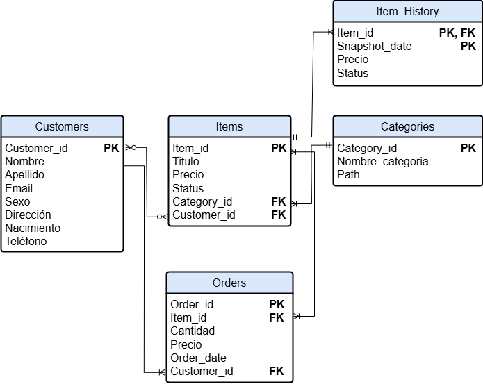

#  Primera Parte - SQL

## **Objetivos:**

### A partir de la siguiente necesidad, se requiere diseñar un DER que responda al modelo del negocio. Luego, se debe responder mediante SQL diferentes preguntas.  

**Descripción de la necesidad**

Teniendo en cuenta el modelo de ecommerce que manejamos, tenemos algunas entidades básicas que queremos representar: Customer, Order, Item y Category. 

- **Customer:** Es la entidad donde se encuentran todos nuestros usuarios, ya sean Buyers o Sellers del Site. Los principales atributos son email, nombre, apellido, sexo, dirección, fecha de nacimiento, teléfono, entre otros. 
- **Item:** Es la entidad donde se encuentran los productos publicados en nuestro marketplace. El volumen es muy grande debido a que se encuentran todos los productos que en algún momento fueron publicados. Mediante el estado del ítem o fecha de baja se puede detectar los ítems activos del marketplace.  
- **Category**: Es la entidad donde se encuentra la descripción de cada categoría con su respectivo path. Cada ítem tiene asociado una categoría. 
- **Order:** La order es la entidad que refleja las transacciones generadas dentro del site (cada compra es una order). En este caso no vamos a contar con un flujo de carrito de compras por lo tanto cada ítem que se venda será reflejado en una order independientemente de la cantidad que se haya comprado.

**Flujo de Compras**
- Un usuario ingresa al sitio de Mercado Libre para comprar dos dispositivos móviles iguales. 
- Realiza la búsqueda navegando por la categorías Tecnología > Celulares y Teléfonos > Celulares y Smartphones, y finalmente encuentra el producto que necesita comprar. 
- Procede con la compra del mismo seleccionado **dos unidades**, el cual genera una orden de compra.

  **A resolver**

- Listar los usuarios que cumplan años el día de hoy cuya cantidad de ventas realizadas en enero 2020 sea superior a 1500. 
- Por cada mes del 2020, se solicita el top 5 de usuarios que más vendieron($) en la categoría Celulares. Se requiere el mes y año de análisis, nombre y apellido del vendedor, cantidad de ventas realizadas, cantidad de productos vendidos y el monto total transaccionado. 

---


##  Estructura del proyecto

```
meli-data-engineer-challenge/
├── create_tables.sql               # DDL para crear las tablas en PostgreSQL
├── cargar_csv_postgres.py          # Script Python para cargar CSVs a PostgreSQL
├── programar_snapshot_cron.sql     # Crea un job con pg_cron para snapshot diario
├── docker-compose.yml              # Configura PostgreSQL + pgAdmin + pg_cron
├── Dockerfile                      # Imagen personalizada con pg_cron compilado
├── init_pgcron.sql                 # Habilita la extensión pg_cron
├── requirements.txt                # Dependencias Python
├── .env.example                    # Variables de entorno
├── respuestas_negocio.sql          # Consultas para resolver las consignas
├── mock_data/                      # CSVs generados con datos simulados
├── notebooks/
│   └── 01_Bases_MELI_Challenge.ipynb
    └── 02_Respuestas_Negocio_MELI_Challenge_.ipynb
└── diagramas/
    └── DER_MercadoLibre_Modelo.png
```
---

## **Respuestas:**


-  Diseñar un DER del modelo de datos que logre responder cada una de laspreguntas mencionadas anteriormente.





- Generar el script DDL para la creación de cada una de las tablas representadas enel DER. Enviarlo con el nombre “create_tables.sql”.


En [01_Bases_MELI_Challenge.ipynb](https://github.com/Arnold-Acuna-Pestana/meli-data-engineer-challenge/blob/main/notebooks/01_Bases_MELI_Challenge.ipynb) se crearon los datos de prueba para resolver las distintos desafios. Luego esos datos fueron cargados en las tablas generadas en [create_tables.sql](https://github.com/Arnold-Acuna-Pestana/meli-data-engineer-challenge/blob/main/create_tables.sql)


- Generar el código SQL para responder cada una de las situaciones mencionadas anteriormente sobre el modelo diseñado. Nombre solicitado:“respuestas_negocio.sql”


En [02_Respuestas_Negocio_MELI_Challenge_.ipynb](https://github.com/Arnold-Acuna-Pestana/meli-data-engineer-challenge/blob/main/notebooks/02_Respuestas_Negocio_MELI_Challenge_.ipynb) se muestra cómo resolver las consultas usando Spark SQL. Adicionalmente, las respuestas se encuentran en el script [respuestas_negocio.sql](https://github.com/Arnold-Acuna-Pestana/meli-data-engineer-challenge/blob/main/respuestas_negocio.sql). 

---


##  Requisitos para ejecutar el proyecto en local

- Docker + Docker Compose
- Python 3.9+
- pip

---

##  Cómo ejecutar el proyecto

### 1. Clonar el repositorio

```bash
git clone https://github.com/Arnold-Acuna-Pestana/meli-data-engineer-challenge.git
```
```bash
cd meli-data-engineer-challenge
```

### 2. Configurar variables de entorno

```bash
cp env.example .env
```

### 3. Levantar la base de datos y pgAdmin

```bash
docker compose up -d --build
```

pgAdmin estará disponible en [http://localhost:8080](http://localhost:8080)

- Email: `admin@example.com`
- Password: `admin`

---

### 4. Copiar el archivo SQL dentro del contenedor. Entrar al contenedor PostgreSQL y ejecutar script para crear las tablas

```bash
docker cp create_tables.sql postgres-ml-cron:/create_tables.sql
```

```bash
docker exec -it postgres-ml-cron bash
```

```bash
psql -U postgres -d meli_challenge -f create_tables.sql
```

---

### 5. Cargar los datos desde los CSV

```bash
pip install -r requirements.txt
```
```bash
python cargar_csv_postgres.py
```

---

### 6. Copiar el archivo SQL al contenedor. Entrar al contenedor PostgreSQL y ejecutar script para programar snapshot diario con pg_cron
```bash
docker cp programar_snapshot_cron.sql postgres-ml-cron:/programar_snapshot_cron.sql
```
```bash
docker exec -it postgres-ml-cron bash
```
```bash
psql -U postgres -d meli_challenge -f programar_snapshot_cron.sql
```

---

### 7. Copiar el archivo SQL al contenedor. Entrar al contenedor PostgreSQL y ejecutar script con las respuestas de negocio
```bash
docker cp respuestas_negocio.sql postgres-ml-cron:/respuestas_negocio.sql
```
```bash
docker exec -it postgres-ml-cron bash
```
```bash
psql -U postgres -d meli_challenge -f /respuestas_negocio.sql
```

---

##  Consultas incluidas

- Clientes que cumplen años hoy y vendieron más de $1500 en enero 2020
- Top 5 vendedores mensuales en categoría "Celulares"
- Registro diario de los items en `item_history` con StoredProcedure y reprocesable (automatizado con `pg_cron` para el final del día)

---


# **Python y APIs**

## **Objetivos:**

### Realizar un análisis sobre la oferta/vidriera de las opciones de productos que responden a distintas búsquedas en el sitio Mercadolibre.com.ar  utilizando el lenguaje Python y las bibliotecas que considere necesarias.

 **A resolver**

-  Barrer una lista de más de 150 ítems ids en el servicio público
-  Por cada resultado, realizar el correspondiente GET por Item_Id al recurso público
-  Escribir los resultados
-  Elaborar el diseño y la documentación de la solución
-  Análisis exploratorio
      

## **Respuesta:**

En la notebook [03_APIS_MELI_Challenge.ipynb](https://github.com/Arnold-Acuna-Pestana/meli-data-engineer-challenge/blob/main/notebooks/03_APIS_MELI_Challenge.ipynb) se documenta un programa que consume datos de el site https://www.mercadolibre.com.ar/ haciendo uso de la api desde https://developers.mercadolibre.com.ar/, para ello el usuario debe ejecutar paso a paso la notebook.


- El primer paso consiste en crear una aplicación en Mercadolibre para poder obtener el token de acceso. Una vez generado y utilizado el token, usuario tendrá acceso a explotar la información.
- Se obtuvo unos 140 productos a través de varios recursos, primero usando el Predictor de categorías para obtener la categoría de productos buscados. Luego con las distintos id de las categorías obtenidas, se utilizo el recurso de Más Vendidos por Categoría para obtener el id de los productos.


### **Idea para comparativo entre productos deseados**

La información obtenida nos ayuda en la evaluación del Precio, Tiempo de Entrega, Envío Gratis, Puntuación, Cuotas, Descuentos y Tiempo de Garantía  antes de tomar cualquier decisión, tambien nos ayuda a verificar el modo de retiro. Por ejemplo, el producto puede estar disponible para retirar en un punto cercano antes que llegue a domicilio.


**Conclusión**
Después de revisar todas estas variables, se puede devolver una puntuación, a mayor valor quiere decir que cumple o posee con las características buscadas.
